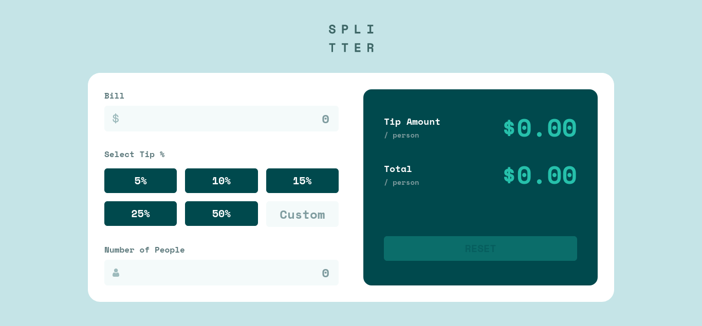

# Frontend Mentor - Tip calculator app solution

This is a solution to the [Tip calculator app challenge on Frontend Mentor](https://www.frontendmentor.io/challenges/tip-calculator-app-ugJNGbJUX). Frontend Mentor challenges help you improve your coding skills by building realistic projects.

## Table of contents

- [Overview](#overview)
  - [The challenge](#the-challenge)
  - [Screenshot](#screenshot)
  - [Links](#links)
- [My process](#my-process)
  - [Built with](#built-with)
  - [What I learned](#what-i-learned)
  - [Continued development](#continued-development)
  - [Useful resources](#useful-resources)
- [Author](#author)

## Overview

### The challenge

Users should be able to:

- View the optimal layout for the app depending on their device's screen size
- See hover states for all interactive elements on the page
- Calculate the correct tip and total cost of the bill per person

### Screenshot



### Links

- Solution URL: [https://github.com/NDOY3M4N/tip-calculator-app](https://github.com/NDOY3M4N/tip-calculator-app)
- Live Site URL: [https://ndoy3m4n.github.io/tip-calculator-app/](https://ndoy3m4n.github.io/tip-calculator-app/)

## My process

### Built with

- Semantic HTML5 markup
- Flexbox
- CSS Grid
- Mobile-first workflow
- [Vue](https://v3.vuejs.org/) - JS library
- [Vite](https://vitejs.dev) - Build Tool
- [Tailwind CSS](https://tailwindcss.com/) - "THE" CSS Framework

### What I learned

I learned that in Vue, the `v-model` directive is a shorthand for `@input` & `:value`

```html
<input v-model="someState" />
```

does the same thing as:

```html
<input :value="someState" @input="someState = $event.target.value" />
```

When used on a component, `v-model` instead does this:

```html
<custom-input
  :model-value="someState"
  @update:model-value="someState = $event"
></custom-input>
```

### Continued development

- [x] Animate the Tip Amount & Total Amount result
- [ ] Switch to typescript
- [ ] Add PWA

### Useful resources

- [Hide arrows from input number](https://www.w3schools.com/howto/howto_css_hide_arrow_number.asp) - This helped me for hiding the default styles (the arrows) in the input number field.
- [Use ref on component](https://stackoverflow.com/questions/67033933/cant-use-template-ref-on-component-in-vue-3-composition-api) - This is stackoverflow post helped me targeting the reset button. I needed this part to disable, blur or focus the button component.

## Author

- Frontend Mentor - [@NDOY3M4N](https://www.frontendmentor.io/profile/NDOY3M4N)
- Twitter - [@NDOY3M4N](https://www.twitter.com/NDOY3M4N)
